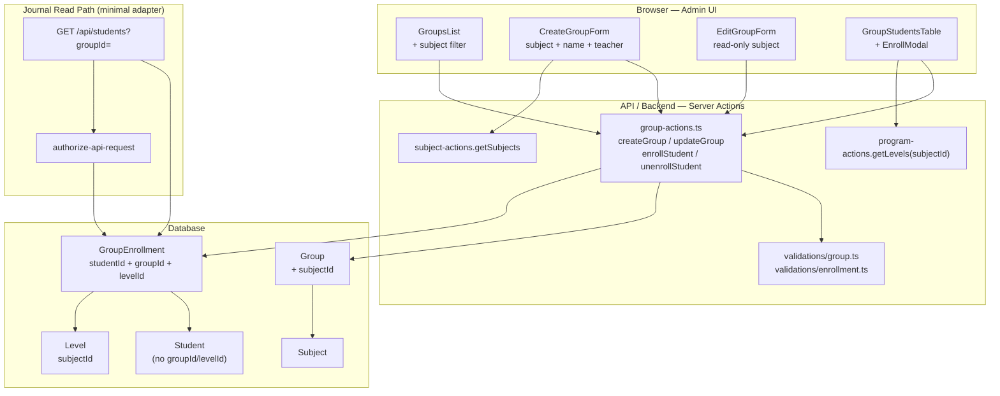

# Phase 11: Groups & Enrollment - Research

**Researched:** 2026-07-07
**Domain:** Prisma many-to-many enrollment, groups bound to subjects, brownfield migration from `Student.groupId`
**Confidence:** HIGH

## Summary

Фаза 11 переводит модель зачисления с **один-ко-многим** (`Student.groupId`) на **many-to-many** через явную junction-таблицу и привязывает каждую группу к одному предмету (`Group.subjectId`). Решения зафиксированы в `11-CONTEXT.md`: уровень программы хранится на записи зачисления, UI зачисления — только на `/groups/[groupId]`, предмет группы неизменяем после создания.

Технически это **additive + data-migration Prisma migration** по образцу Phase 10 (`20260707180000_add_subject`): `ADD COLUMN` → backfill `DEFAULT_QURAN_SUBJECT_ID` → `CREATE TABLE` junction → `INSERT` из `Student` → удаление `Student.groupId` / `Student.levelId`. Новых npm-пакетов не требуется — только Prisma 7.8.0, Zod, Ant Design, существующие server actions.

Критический интеграционный риск: **~25+ файлов** читают `student.groupId` / `group.students` (журнал, API `/api/students`, `authorize-api-request`, `user-admin`, аналитика). Полный subject-scoped журнал — Phase 13, но Phase 11 **обязана** обновить запросы списка учеников группы через junction, иначе сломается журнал и E2E сразу после удаления колонки. `Student.currentStepIdx` остаётся на `Student` до Phase 12 (глобальный прогресс — временная несогласованность с per-enrollment `levelId`).

**Primary recommendation:** Одна prod-safe миграция (`Group.subjectId` + `GroupEnrollment` + backfill + drop `Student.groupId`/`levelId`) → расширить `group-actions` (subject, enrollment CRUD) → UI: предмет в форме группы, фильтр в списке, модалка зачисления на странице группы → минимальные адаптеры journal/API для выборки учеников через `GroupEnrollment`.

## Architectural Responsibility Map

| Capability | Primary Tier | Secondary Tier | Rationale |
|------------|-------------|----------------|-----------|
| `Group.subjectId` (1 группа = 1 предмет) | Database / Storage | API / Backend (Prisma migration + Zod) | FK и NOT NULL — персистентный слой; валидация при create |
| Many-to-many зачисление (ученик ↔ группы) | Database / Storage | API / Backend | Junction — единственный источник истины (D-01) |
| Уровень на зачислении (`levelId` на junction) | Database / Storage | API / Backend | Бизнес-правило: level ∈ program(subject группы) |
| UI создания/редактирования группы | Browser (Ant Design forms) | Frontend Server (RSC page) | Формы client; данные предметов/учителей — server fetch |
| UI зачисления/снятия на `/groups/[groupId]` | Browser (Modal + Table) | API / Backend (enrollment actions) | D-02: только страница группы |
| Список групп + фильтр по предмету | Browser (Table filter) | API / Backend (`getGroups` + subject include) | Фильтр client-side или server-side — на усмотрение planner |
| Миграция prod-данных (`groupId` → junction) | Database / Storage (SQL migration) | — | Backfill в `migration.sql`, не в seed |
| Journal/API список учеников группы | API / Backend | Browser (React Query hooks) | `/api/students?groupId=` должен join через enrollment |
| Глобальный прогресс (`currentStepIdx`) | Database / Storage (`Student`) | — | **Out of scope Phase 11** — Phase 12; не удалять колонку |

<user_constraints>
## User Constraints (from CONTEXT.md)

### Locked Decisions

#### Модель зачисления (Student ↔ Group)
- **D-01:** Удалить `Student.groupId` — единственный источник зачислений: junction-таблица (например `StudentGroup` / `GroupEnrollment`).
- **D-02:** UI зачисления **только на странице группы** `/groups/[groupId]` — добавление и удаление учеников из состава группы.
- **D-03:** Добавление существующего ученика — модалка с поиском/выбором из **всех учеников системы** (уже в другой группе — допустимо).
- **D-04:** При зачислении в группу **обязательно выбирать уровень** программы предмета этой группы.
- **D-05:** Уровень хранится **на записи зачисления** (junction), не глобально на `Student` — у каждой пары ученик+группа свой `levelId`.

#### Предмет у группы
- **D-06:** `subjectId` **обязателен** при создании группы — без предмета группу создать нельзя.
- **D-07:** Предмет **не меняется** после создания — поле read-only при редактировании группы (только имя и учитель).
- **D-08:** Список групп `/groups` — колонка **«Предмет»** + **фильтр по предмету**.
- **D-09:** Форма группы: предмет + название + учитель. Уровни программы на форме группы **не выбираются** — только при зачислении ученика.

#### Несколько групп одного предмета
- **D-10:** Ученик **может** быть зачислен в две и более группы **одного и того же предмета** (не запрещать).
- **D-11:** При дублировании предмета уровень **независим на каждое зачисление** (две группы Корана → два `levelId` в junction).

### Claude's Discretion
- Имя и точная схема junction (`StudentGroup` vs `GroupEnrollment`), поля `enrolledAt`, индексы, `@@unique` при необходимости.
- **Миграция данных** (область не обсуждалась с пользователем): привязать существующие группы к предмету «Коран» (`DEFAULT_QURAN_SUBJECT_ID`); перенести `Student.groupId` + `Student.levelId` в junction; безопасная prod-migration по правилам prisma-migrations.
- Адаптация `user-admin` / `createUsers` при удалении `Student.groupId` (минимальные изменения для сохранения создания ученика).
- Валидация: уровень при зачислении должен принадлежать `group.subjectId`.

### Deferred Ideas (OUT OF SCOPE)
- Прогресс ученика по предмету (`StudentSubjectProgress`, `currentStepIdx` per subject) — Phase 12
- Сессии и completions в скоупе предмета — Phase 12
- Журнал: автоматический предмет из группы — Phase 13
- Детальная стратегия миграции prod-данных — на усмотрение planner (пользователь не выбирал отдельную область «миграция»)
</user_constraints>

<phase_requirements>
## Phase Requirements

| ID | Description | Research Support |
|----|-------------|------------------|
| SUBJ-05 | Группа привязана ровно к одному предмету | `Group.subjectId` NOT NULL FK → `Subject`; отображение в `GroupsList`; immutable после create (D-07) |
| SUBJ-06 | Ученик может быть зачислен в несколько групп | Junction `GroupEnrollment` с `@@unique([studentId, groupId])` без unique по subject; удаление `Student.groupId` |
| SUBJ-07 | Менеджер назначает предмет при создании группы | `subjectId` в `createGroupSchema` + Select в `CreateGroupForm`; при edit — read-only display (D-07 уточняет: не при редактировании) |
</phase_requirements>

## Project Constraints (from .cursor/rules/)

- **Prisma migrations (prod-safe):** `pnpm db:migrate -- --name ...` локально; на test/prod только `pnpm db:migrate:deploy`. Запрещены `migrate reset`, `db:push`, `db:seed` на prod [CITED: `.cursor/rules/prisma-migrations.mdc`].
- **SQL в миграции:** предпочтительно `CREATE TABLE`, `ADD COLUMN`, backfill `UPDATE`, индексы. `DROP COLUMN` для `Student.groupId`/`levelId` — допустимо по явному решению D-01/D-05 в CONTEXT.
- **FSD:** изменения в `src/features/groups/`; валидации в `src/shared/lib/validations/`; не импортировать `features` из `shared`.
- **UI Ant Design:** не использовать `Modal.confirm` / `message` статически — только `App.useApp()` [CITED: `.cursor/rules/antd-app-context.mdc`].
- **Новый модуль = E2E:** добавить `e2e/groups-enrollment.spec.ts` в том же PR [CITED: `.cursor/rules/new-module-tests.mdc`].
- **Язык UI:** русский.

## Standard Stack

### Core

| Library | Version | Purpose | Why Standard |
|---------|---------|---------|--------------|
| Prisma | 7.8.0 | ORM, migrations, `GroupEnrollment` model | Единственный persistence layer проекта |
| @prisma/client | 7.8.0 | Type-safe queries для enrollment | Генерируется из `schema.prisma` |
| Next.js | 16.1.6 | App Router, server actions | Существующий full-stack |
| Zod | 4.3.6 | `createGroupSchema`, `enrollStudentSchema` | Паттерн `src/shared/lib/validations/` |
| antd | 6.4.3 | GroupsList, модалки, Select предмета/уровня | Паттерн `groups` + `subject-admin` |

### Supporting

| Library | Version | Purpose | When to Use |
|---------|---------|---------|-------------|
| @tanstack/react-query | 5.90.21 | — | **Не нужен** для enrollment admin (server actions + `router.refresh`) |
| vitest | 4.1.9 | Unit-тесты валидации enrollment | Wave 0 — Zod refine level∈subject |
| @playwright/test | 1.61.0 | E2E зачисление/группы | Обязательно по `new-module-tests.mdc` |

### Alternatives Considered

| Instead of | Could Use | Tradeoff |
|------------|-----------|----------|
| Explicit junction `GroupEnrollment` | Prisma implicit many-to-many | Проект уже использует explicit junction (`StudentExtraAssignment`, `PostLike`) — нужен `levelId` на записи |
| REST API для enrollment | Server actions | Admin CRUD в проекте — server actions (`group-actions.ts`); API только для journal read |
| Имя `StudentGroup` | `GroupEnrollment` | Оба допустимы (D discretion); рекомендуем `GroupEnrollment` — яснее домен «зачисление» |

**Installation:** новых пакетов нет.

**Version verification:** Prisma 7.8.0, Next 16.1.6, Zod 4.3.6, antd 6.4.3 — из `package.json` [VERIFIED: codebase grep].

## Package Legitimacy Audit

Фаза 11 **не устанавливает** внешние пакеты. Используется только существующий стек.

| Package | Registry | Verdict | Disposition |
|---------|----------|---------|-------------|
| — | — | — | N/A — no new packages |

**Packages removed due to [SLOP] verdict:** none
**Packages flagged as suspicious [SUS]:** none

## Architecture Patterns

### System Architecture Diagram



### Recommended Project Structure

```
prisma/
├── schema.prisma              # Group.subjectId, GroupEnrollment, drop Student.groupId/levelId
├── migrations/..._group_enrollment/migration.sql
└── lib/subject-constants.ts   # DEFAULT_QURAN_SUBJECT_ID (backfill)

src/shared/lib/validations/
├── group.ts                   # createGroupSchema (+subjectId), updateGroupSchema (no subjectId)
└── enrollment.ts              # enrollStudentSchema, level∈subject refine

src/features/groups/
├── actions/group-actions.ts   # + getSubjects for forms, enrollment CRUD
└── ui/
    ├── GroupsList.tsx         # + колонка Предмет, фильтр
    ├── CreateGroupForm.tsx    # + Select предмета
    ├── EditGroupForm.tsx      # read-only предмет
    ├── GroupStudentsTable.tsx # + кнопка «Добавить ученика», unenroll
    └── EnrollStudentModal.tsx # поиск ученика + Select уровня (subject-scoped)

src/app/(dashboard)/groups/
├── page.tsx                   # передать subjects для фильтра
└── [groupId]/page.tsx         # enrollments вместо group.students
```

### Pattern 1: Explicit Junction Table (рекомендуемая схема)

**What:** Many-to-many с атрибутами на связи (`levelId`, `enrolledAt`) — explicit model, не implicit Prisma M:N.

**When to use:** Всегда для Phase 11 (D-04, D-05).

**Recommended Prisma model:**

```prisma
model Group {
  id          String            @id @default(cuid())
  name        String
  subjectId   String
  subject     Subject           @relation(fields: [subjectId], references: [id], onDelete: Restrict)
  teacherId   String
  teacher     Teacher           @relation(fields: [teacherId], references: [id])
  enrollments GroupEnrollment[]
  teachingSessions TeachingSession[]
  @@index([subjectId])
}

model GroupEnrollment {
  id         String   @id @default(cuid())
  studentId  String
  student    Student  @relation(fields: [studentId], references: [id], onDelete: Cascade)
  groupId    String
  group      Group    @relation(fields: [groupId], references: [id], onDelete: Cascade)
  levelId    String
  level      Level    @relation(fields: [levelId], references: [id], onDelete: Restrict)
  enrolledAt DateTime @default(now())

  @@unique([studentId, groupId])
  @@index([groupId])
  @@index([studentId])
}

model Student {
  id             String            @id @default(cuid())
  // ... existing fields except groupId, levelId
  currentStepIdx Int               @default(0)  // Phase 12: per-subject progress
  enrollments    GroupEnrollment[]
  // remove: groupId, levelId, group, level relations
}

model Subject {
  // ... existing
  groups Group[]
}
```

**Индексы:** `@@unique([studentId, groupId])` — повторное зачисление в ту же группу запрещено; **нет** `@@unique([studentId, subjectId])` — D-10 разрешает несколько групп одного предмета.

### Pattern 2: Prod-Safe Migration (образец Phase 10)

**What:** Многошаговая SQL-миграция без потери данных.

**When to use:** Любое изменение `schema.prisma` на prod (Dokploy).

**Порядок операций** (аналог `20260707180000_add_subject/migration.sql`):

```sql
-- 1. Group.subjectId: nullable → backfill → NOT NULL
ALTER TABLE "Group" ADD COLUMN "subjectId" TEXT;
UPDATE "Group" SET "subjectId" = 'clq10defaultquransubject00';
ALTER TABLE "Group" ALTER COLUMN "subjectId" SET NOT NULL;
ALTER TABLE "Group" ADD CONSTRAINT "Group_subjectId_fkey" ...;
CREATE INDEX "Group_subjectId_idx" ON "Group"("subjectId");

-- 2. Create GroupEnrollment
CREATE TABLE "GroupEnrollment" (...);

-- 3. Backfill from Student
INSERT INTO "GroupEnrollment" ("id", "studentId", "groupId", "levelId", "enrolledAt")
SELECT gen_random_uuid()::text, "id", "groupId", "levelId", NOW()
FROM "Student"
WHERE "groupId" IS NOT NULL;  -- все текущие студенты

-- 4. Drop old FKs and columns on Student
ALTER TABLE "Student" DROP CONSTRAINT "Student_groupId_fkey";
ALTER TABLE "Student" DROP COLUMN "groupId";
ALTER TABLE "Student" DROP CONSTRAINT "Student_levelId_fkey";
ALTER TABLE "Student" DROP COLUMN "levelId";

-- 5. Drop Group.students implicit relation (Prisma handles via enrollments)
```

**Note:** для `id` в backfill использовать `cuid()`-совместимую генерацию или Prisma `@default(cuid())` через промежуточный скрипт — planner выбирает: SQL `gen_random_uuid()` vs application-level seed step [ASSUMED: PostgreSQL `gen_random_uuid()` приемлем для migration id].

### Pattern 3: Enrollment Server Action с валидацией уровня

**What:** Зачисление в транзакции с проверкой `level.subjectId === group.subjectId`.

**Example (по паттерну `group-actions.ts` + `createUsers`):**

```typescript
// src/features/groups/actions/group-actions.ts
const enrollStudentSchema = z.object({
  studentId: z.string().min(1),
  levelId: z.string().min(1, 'Выберите уровень'),
})

export async function enrollStudent(groupId: string, input: unknown) {
  await requireRoles(['MANAGER', 'SUPER_ADMIN'])
  const data = enrollStudentSchema.parse(input)

  const group = await prisma.group.findUnique({
    where: { id: groupId },
    select: { subjectId: true },
  })
  if (!group) throw new Error('Группа не найдена')

  const level = await prisma.level.findFirst({
    where: { id: data.levelId, subjectId: group.subjectId },
  })
  if (!level) throw new Error('Уровень не принадлежит предмету группы')

  await prisma.groupEnrollment.create({
    data: {
      studentId: data.studentId,
      groupId,
      levelId: data.levelId,
    },
  })

  revalidatePath(`/groups/${groupId}`)
  revalidatePath('/groups')
  revalidatePath('/journal')
}
```

### Pattern 4: Запрос учеников группы через enrollment

**What:** Заменить `group.students` на `group.enrollments` с include level из enrollment.

```typescript
// Было (group-actions.ts getGroup):
students: { include: { user: true, level: true } }

// Стало:
enrollments: {
  include: {
    student: { include: { user: true } },
    level: true,
  },
  orderBy: { student: { user: { name: 'asc' } } },
}
```

Для journal API (`src/app/api/students/route.ts`):

```typescript
const group = await prisma.group.findUnique({
  where: { id: groupId },
  include: {
    enrollments: {
      include: {
        student: {
          include: {
            user: true,
            sessions: dayRange ? { /* ... */ } : false,
          },
        },
        level: true,
      },
    },
  },
})

const students = group.enrollments
  .map((e) => ({ ...e.student, enrollmentLevel: e.level }))
  .filter((s) => isJournalVisibleStatus(s.status))
  // levelNumber/levelTitle из enrollmentLevel, не student.level
```

### Pattern 5: createUsers — минимальная адаптация

**What:** Создание `Student` без `groupId`/`levelId`; при переданных `groupId`+`levelId` — дополнительно `GroupEnrollment`.

```typescript
// user-actions.ts createUsers — STUDENT branch
const user = await tx.user.create({
  data: {
    name: entry.name,
    code,
    role: 'STUDENT',
    student: {
      create: {
        fullName: entry.fullName ?? entry.name,
        phone: entry.phone,
        guardianName: entry.guardianName,
        guardianPhone: entry.guardianPhone,
        currentStepIdx,
        // no groupId, no levelId
      },
    },
  },
  include: { student: true },
})

if (data.groupId && level) {
  const group = await tx.group.findUnique({
    where: { id: data.groupId },
    select: { subjectId: true },
  })
  if (!group || level.subjectId !== group.subjectId) {
    throw new Error('Уровень не соответствует предмету группы')
  }
  await tx.groupEnrollment.create({
    data: {
      studentId: user.student!.id,
      groupId: data.groupId,
      levelId: level.id,
    },
  })
}
```

`getLevelsForCreateUser()` → заменить на subject-scoped: принимать `subjectId` или загружать уровни группы после выбора группы в форме (client cascade).

### Anti-Patterns to Avoid

- **Implicit Prisma many-to-many без `levelId`:** не покрывает D-04/D-05.
- **Оставить `Student.groupId` «для журнала»:** противоречит D-01; вместо этого — adapter в API.
- **Unique (studentId, subjectId):** запрещает D-10 (две группы одного предмета).
- **Смена предмета группы в edit:** против D-07.
- **Зачисление из UserDetailModal:** против D-02 — только `/groups/[groupId]`.
- **`pnpm db:push` на prod:** ломает migrate history.

## Don't Hand-Roll

| Problem | Don't Build | Use Instead | Why |
|---------|-------------|-------------|-----|
| Many-to-many с атрибутами | Map в JSON на Student | Prisma `GroupEnrollment` model | Запросы, FK, cascade, типизация |
| Prod data migration | Одноразовый SQL вне migrations | `prisma/migrations/.../migration.sql` | Dokploy deploy pipeline, audit trail |
| Backfill subject для групп | Hardcode в seed only | `DEFAULT_QURAN_SUBJECT_ID` в migration SQL | Phase 10 уже зафиксировал id [VERIFIED: `prisma/lib/subject-constants.ts`] |
| Валидация level ∈ subject | Проверка только на клиенте | Server action + Prisma `findFirst({ id, subjectId })` | ASVS V5 — never trust client |
| Список предметов в форме | Новый API route | `getSubjects()` из `subject-admin` | Уже существует |
| Уровни для picker зачисления | Глобальный `getLevelsForCreateUser()` | `getLevels(subjectId)` из `program-actions` | Subject-scoped с Phase 10 |
| Auth check student∈group | Custom middleware | Расширить `authorize-api-request` — join `GroupEnrollment` | Единый default-deny паттерн |

**Key insight:** Junction с бизнес-атрибутами (`levelId`) — это не «просто связь», а доменная сущность; explicit model обязателен.

## Runtime State Inventory

| Category | Items Found | Action Required |
|----------|-------------|------------------|
| Stored data | `Student.groupId`, `Student.levelId` на всех записях Student; `Group` без `subjectId` | SQL migration: INSERT `GroupEnrollment`, backfill `Group.subjectId`, DROP columns |
| Live service config | None — verified: нет внешних конфигов с groupId | None |
| OS-registered state | None | None |
| Secrets/env vars | None — `DATABASE_URL` без изменений | None |
| Build artifacts | `generated/prisma/` после schema change | `pnpm exec prisma generate` / postinstall |

## Common Pitfalls

### Pitfall 1: Journal/API всё ещё читают `student.groupId`

**What goes wrong:** После миграции `GET /api/students`, `authorize-api-request`, `journal-actions`, `StudentList` падают с Prisma/TypeScript ошибками.

**Why it happens:** ~25 файлов с `groupId` (grep); Phase 13 откладывает subject-scoped журнал, но колонка удаляется в Phase 11.

**How to avoid:** Чеклист файлов для адаптации в плане:
- `src/app/api/students/route.ts`
- `src/shared/lib/authorize-api-request.ts` (STUDENT role + groupId)
- `src/features/groups/actions/group-actions.ts` (`getGroup`, `getMyGroup`)
- `src/features/journal/actions/journal-actions.ts` (`requireTeacherStudent`, `getStudentLesson`)
- `src/features/user-admin/actions/user-actions.ts` (`createUsers`, `updateStudentUser`)
- `src/shared/lib/validations/user.ts`
- `src/features/user-admin/lib/map-users-to-details.ts`
- `prisma/seed.ts`, `prisma/seed-e2e.ts`

**Warning signs:** `tsc` errors на `student.groupId`; E2E `journal.spec.ts`, `api-auth.spec.ts` fail.

### Pitfall 2: Валидация уровня не привязана к предмету группы

**What goes wrong:** Ученик зачислен с уровнем Таджвида в группу Корана.

**Why it happens:** `getLevelsForCreateUser()` возвращает все уровни всех предметов.

**How to avoid:** `enrollStudent` и `createUsers` проверяют `level.subjectId === group.subjectId`; UI picker загружает `getLevels(group.subjectId)`.

**Warning signs:** Несовпадение `level.number` с программой предмета в UI группы.

### Pitfall 3: `Student.currentStepIdx` vs enrollment `levelId`

**What goes wrong:** В таблице группы уровень из enrollment, а шаг из глобального `currentStepIdx` — визуально несогласованно.

**Why it happens:** Per-subject progress — Phase 12; в Phase 11 оба поля сосуществуют.

**How to avoid:** Документировать как known limitation; в UI группы показывать level из enrollment; `currentStepIdx` — с пометкой «глобальный, обновится в Phase 12» или скрыть колонку шага до Phase 12 [ASSUMED: оставить колонку с текущим поведением для backward compat].

### Pitfall 4: UserDetailModal меняет группу/уровень

**What goes wrong:** Нарушение D-02 — зачисление вне страницы группы.

**How to avoid:** На `/groups/[groupId]` — `readOnly` для group/level в модалке или убрать поля; смена уровня зачисления — отдельный action `updateEnrollmentLevel` (optional в Phase 11).

### Pitfall 5: Миграция без backfill

**What goes wrong:** Prod студенты теряют привязку к группе при DROP `groupId`.

**How to avoid:** INSERT into `GroupEnrollment` **до** DROP; проверить `COUNT(*)` Student = COUNT enrollment после migrate на staging.

### Pitfall 6: `getTeacherGroup` при нескольких группах учителя

**What goes wrong:** `findFirst` возвращает произвольную группу.

**Why it happens:** Учитель может вести несколько групп (разные предметы).

**How to avoid:** Out of scope Phase 11 (выбор группы в журнале — Phase 13); **не ломать** текущее поведение — оставить `findFirst`, задокументировать tech debt.

## Code Examples

### Phase 10 migration backfill (образец для Group.subjectId)

```sql
-- Source: prisma/migrations/20260707180000_add_subject/migration.sql
ALTER TABLE "Level" ADD COLUMN "subjectId" TEXT;
UPDATE "Level" SET "subjectId" = 'clq10defaultquransubject00';
ALTER TABLE "Level" ALTER COLUMN "subjectId" SET NOT NULL;
```

### Текущий Group без subject (до Phase 11)

```120:127:prisma/schema.prisma
model Group {
  id               String            @id @default(cuid())
  name             String
  teacherId        String
  teacher          Teacher           @relation(fields: [teacherId], references: [id])
  students         Student[]
  teachingSessions TeachingSession[]
}
```

### Текущий Student с groupId/levelId (удалить)

```129:141:prisma/schema.prisma
model Student {
  id             String           @id @default(cuid())
  userId         String           @unique
  user           User             @relation(fields: [userId], references: [id], onDelete: Cascade)
  fullName       String?
  phone          String?
  guardianName   String?
  guardianPhone  String?
  groupId        String
  group          Group            @relation(fields: [groupId], references: [id])
  levelId        String
  level          Level            @relation(fields: [levelId], references: [id])
```

### createGroup — текущий (добавить subjectId)

```9:12:src/features/groups/actions/group-actions.ts
const createGroupSchema = z.object({
	name: z.string().min(1),
	teacherId: z.string(),
})
```

### getLevels subject-scoped (Phase 10 — для picker уровня)

```73:79:src/features/program-admin/actions/program-actions.ts
export async function getLevels(subjectId: string) {
	await requireRoles(['SUPER_ADMIN', 'MANAGER'])
	return prisma.level.findMany({
		where: { subjectId },
		include: { _count: { select: { steps: true } } },
		orderBy: { number: 'asc' },
	})
}
```

### API students — текущая зависимость от group.students

```26:48:src/app/api/students/route.ts
	const group = await prisma.group.findUnique({
		where: { id: groupId },
		include: {
			students: {
				include: {
					user: true,
					level: true,
					sessions: dayRange
						? {
								where: {
									date: { gte: dayRange.start, lte: dayRange.end },
								},
								orderBy: { date: 'desc' },
								include: { completions: true },
							}
						: false,
				},
			},
		},
	})

	if (!group) return error('Группа не найдена', 404)
```

### authorize-api-request — STUDENT + groupId

```48:54:src/shared/lib/authorize-api-request.ts
		if (ctx.groupId) {
			const own = await prisma.student.findUnique({
				where: { id: actorStudentId! },
				select: { groupId: true },
			})
			if (!own || own.groupId !== ctx.groupId) return { error: forbidden() }
		}
```

Заменить на проверку `GroupEnrollment` с `studentId` + `groupId`.

### DEFAULT_QURAN_SUBJECT_ID

```1:5:prisma/lib/subject-constants.ts
/**
 * Fixed cuid for the default «Коран» subject created during migration backfill.
 * The migration SQL INSERT must use this exact id — do not change without a new migration.
 */
export const DEFAULT_QURAN_SUBJECT_ID = 'clq10defaultquransubject00'
```

### Zod refine для createUsers (текущий — изменить стратегию)

```99:106:src/shared/lib/validations/user.ts
	.refine((data) => data.role !== 'STUDENT' || !!data.groupId, {
		message: 'Выберите группу',
		path: ['groupId'],
	})
	.refine((data) => data.role !== 'STUDENT' || !!data.levelId, {
		message: 'Выберите уровень',
		path: ['levelId'],
	})
```

Рекомендация: сохранить обязательность `groupId`+`levelId` при bulk-create STUDENT (создаёт enrollment), либо сделать optional и зачислять только на странице группы — planner выбирает minimal path (скорее сохранить для UX `admin.spec.ts`).

## State of the Art

| Old Approach | Current Approach | When Changed | Impact |
|--------------|------------------|--------------|--------|
| `Student.groupId` (1 группа) | `GroupEnrollment` junction | Phase 11 | Multi-group enrollment |
| Глобальный `Student.levelId` | `GroupEnrollment.levelId` per group | Phase 11 | Разные уровни в разных группах |
| Group без предмета | `Group.subjectId` required | Phase 11 | SUBJ-05 |
| `Level.number @unique` global | `@@unique([subjectId, number])` | Phase 10 | Уровни для picker — subject-scoped |

**Deprecated/outdated:**
- `group.students` Prisma relation — заменить на `group.enrollments`
- `getLevelsForCreateUser()` без subjectId — заменить на `getLevels(subjectId)` или cascade от выбранной группы

## Assumptions Log

| # | Claim | Section | Risk if Wrong |
|---|-------|---------|---------------|
| A1 | `GroupEnrollment` — рекомендуемое имя модели (vs `StudentGroup`) | Pattern 1 | Low — оба валидны per D discretion |
| A2 | SQL backfill enrollment id через `gen_random_uuid()` | Pattern 2 | Medium — нужен cuid-совместимый формат |
| A3 | `Student.currentStepIdx` остаётся на Student в Phase 11 | Pitfall 3 | Low — Phase 12 явно deferred |
| A4 | `createUsers` сохраняет обязательный groupId+levelId (через enrollment) | Pattern 5 | Medium — UX admin create student |
| A5 | Колонка «Текущий шаг» в GroupStudentsTable остаётся до Phase 12 | Pitfall 3 | Low — cosmetic inconsistency |

## Open Questions

**RESOLVED** (2026-07-07, plan revision):

1. **updateStudentUser — убрать groupId/levelId полностью?**
   - **Resolution:** Да — убрать из updateStudentUserSchema; профиль только ФИО/контакты. Перенос группы = unenroll + enroll на `/groups/[groupId]`. Реализация: plan 11-06 Task 1.

2. **Изменение levelId существующего зачисления**
   - **Resolution:** MVP Phase 11 — только при enroll; смена уровня в UI зачисления не в scope. student-admin progress edit остаётся глобальным tech debt до Phase 12. Реализация: plan 11-06 Task 2.

3. **SUBJ-07 wording vs D-07**
   - **Resolution:** Следовать CONTEXT (locked) — subject только при create, read-only при edit. Реализация: plan 11-02.

## Environment Availability

| Dependency | Required By | Available | Version | Fallback |
|------------|------------|-----------|---------|----------|
| Node.js | build/dev | ✓ | >=22.12 (package.json engines) | — |
| PostgreSQL | Prisma migration | ✓ (project standard) | — | docker compose profile local-db |
| pnpm | package manager | ✓ | 9 | — |
| Prisma CLI | migrations | ✓ | 7.8.0 | — |

**Missing dependencies with no fallback:** none

## Validation Architecture

### Test Framework

| Property | Value |
|----------|-------|
| Framework | Vitest 4.1.9 (unit) + Playwright 1.61.0 (E2E) |
| Config file | `vitest.config.ts`, `playwright.config.ts` |
| Quick run command | `pnpm test:unit` |
| Full suite command | `pnpm test:e2e` |

### Phase Requirements → Test Map

| Req ID | Behavior | Test Type | Automated Command | File Exists? |
|--------|----------|-----------|-------------------|-------------|
| SUBJ-05 | Группа создаётся с обязательным предметом | e2e | `pnpm test:e2e e2e/groups-enrollment.spec.ts` | ❌ Wave 0 |
| SUBJ-05 | Предмет read-only при edit группы | e2e | same | ❌ Wave 0 |
| SUBJ-06 | Ученик в двух группах | e2e | same | ❌ Wave 0 |
| SUBJ-06 | Зачисление с выбором уровня предмета | e2e | same | ❌ Wave 0 |
| SUBJ-07 | Колонка и фильтр «Предмет» в списке групп | e2e | same | ❌ Wave 0 |
| SUBJ-05 | `levelId` не принадлежит `group.subjectId` → ошибка | unit | `pnpm test:unit src/shared/lib/validations/enrollment.test.ts` | ❌ Wave 0 |
| SUBJ-06 | Migration backfill Student→Enrollment | manual/staging | `pnpm db:migrate:deploy` + SQL count check | ❌ Wave 0 |

### Sampling Rate

- **Per task commit:** `pnpm test:unit` (если затронуты validations)
- **Per wave merge:** `pnpm test:e2e e2e/groups-enrollment.spec.ts e2e/journal.spec.ts e2e/api-auth.spec.ts`
- **Phase gate:** Full E2E green before `/gsd-verify-work`

### Wave 0 Gaps

- [ ] `e2e/groups-enrollment.spec.ts` — SUBJ-05..07 happy path + role access
- [ ] `src/shared/lib/validations/enrollment.test.ts` — level∈subject Zod/server guard
- [ ] Обновить `e2e/admin.spec.ts` — create student через enrollment flow
- [ ] Обновить `prisma/seed-e2e.ts` — `GroupEnrollment` вместо `Student.groupId`
- [ ] `pnpm exec prisma generate` после schema migration

## Security Domain

### Applicable ASVS Categories

| ASVS Category | Applies | Standard Control |
|---------------|---------|-----------------|
| V2 Authentication | no | NextAuth без изменений |
| V3 Session Management | no | — |
| V4 Access Control | yes | `requireRoles(['MANAGER','SUPER_ADMIN'])` для enrollment; `authorize-api-request` для journal API |
| V5 Input Validation | yes | Zod schemas; server-side `level.subjectId === group.subjectId` |
| V6 Cryptography | no | — |

### Known Threat Patterns for {stack}

| Pattern | STRIDE | Standard Mitigation |
|---------|--------|---------------------|
| Зачисление с чужим levelId другого предмета | Tampering | Prisma `findFirst({ id, subjectId })` в server action |
| IDOR: enroll/unenroll в чужую группу | Elevation | `requireRoles` + groupId из URL проверяется в action |
| Student API: доступ к чужой группе | Info disclosure | `authorize-api-request` — enrollment join вместо `student.groupId` |
| Mass assignment subjectId при update | Tampering | `updateGroupSchema` без `subjectId` (D-07) |

## Sources

### Primary (HIGH confidence)
- `prisma/schema.prisma` — текущие Group, Student models
- `prisma/migrations/20260707180000_add_subject/migration.sql` — prod-safe migration pattern
- `prisma/lib/subject-constants.ts` — DEFAULT_QURAN_SUBJECT_ID
- `src/features/groups/actions/group-actions.ts` — CRUD pattern
- `src/features/program-admin/actions/program-actions.ts` — getLevels(subjectId)
- `.planning/phases/11-groups-enrollment/11-CONTEXT.md` — locked decisions

### Secondary (MEDIUM confidence)
- `.cursor/rules/prisma-migrations.mdc` — prod deploy rules
- `.planning/phases/10-subject-foundation/10-PATTERNS.md` — analog map groups→subjects

### Tertiary (LOW confidence)
- PostgreSQL `gen_random_uuid()` для migration ids — [ASSUMED] acceptable for cuid text ids

## Metadata

**Confidence breakdown:**
- Standard stack: HIGH — no new packages; existing Prisma/Zod/antd patterns
- Architecture: HIGH — explicit junction + Phase 10 migration template verified in repo
- Pitfalls: HIGH — grep inventory of groupId usages completed

**Research date:** 2026-07-07
**Valid until:** 2026-08-07 (stable brownfield patterns)
