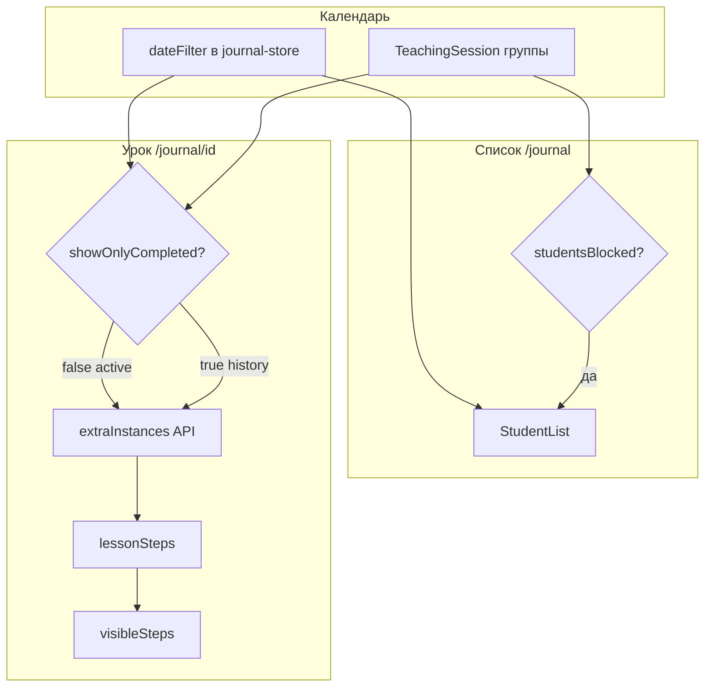

# Журнал — технический справочник

> **Версия документа:** июль 2026  
> Каноническое описание поведения журнала, календаря и страницы оценки ученика.  
> **Обновлять при любых изменениях логики журнала**, чтобы зафиксированные решения не терялись между сессиями.

---

## 1. Назначение

Журнал — основной рабочий экран **учителя**. Позволяет:

- вести **групповой урок** (Teaching Session) с учётом времени;
- выбирать **календарный день** и видеть сводку по группе;
- открывать **урок конкретного ученика**: посещаемость, оценки шагов программы, доп. задания;
- сохранять данные в `Session` + `StepCompletion` и отдельно — оценки доп. заданий.

**Core value:** учитель видит, что пройдено сегодня и раньше, может дать доп. задание и оценить его в другой день; история дня показывает только активность этого дня.

**Роли:** страницы журнала доступны роли `TEACHER` (своя группа). Менеджер/супер-админ могут частично видеть данные через API (список учеников, доп. задания).

---

## 2. Маршруты

| URL | Компонент | Назначение |
|-----|-----------|------------|
| `/journal` | `StudentList` | Список учеников группы на выбранный день |
| `/journal/[studentId]` | `LessonPage` | Урок / оценка одного ученика |
| `/journal/history` | `JournalHistoryPage` | История шагов (фильтр по ученику и дате) |
| `/journal/[studentId]/history` | `StepHistoryPage` | История шагов одного ученика |
| `/extra-assignments` | справочник доп. заданий | CRUD шаблонов (TEACHER, MANAGER, SUPER_ADMIN) |

---

## 3. Календарь и даты

### 3.1. Часовой пояс

Все **календарные дни журнала** — в поясе **`Europe/Moscow`** (`APP_TIMEZONE` в `src/shared/lib/calendar-date.ts`).

Функции:

| Функция | Назначение |
|---------|------------|
| `getLocalDateString()` | Сегодня как `YYYY-MM-DD` в MSK |
| `isSameCalendarDay(date, dateStr)` | Совпадает ли момент времени с календарным днём |
| `getCalendarDayQueryRange(dateStr)` | Широкий UTC-интервал ±24ч от полудня для выборки сессий из БД |
| `toSessionDate(dateStr)` | Дата сессии в БД: `${dateStr}T12:00:00.000Z` |
| `isJournalFutureDayBlocked(dateStr)` | Блокировка навигации в будущие дни |
| `TEMP_ALLOW_FUTURE_JOURNAL_DATES` | **Временный флаг `true`** — будущие дни **не блокируются** (убрать перед продом) |

### 3.2. Глобальное состояние даты — `dateFilter`

Zustand-store `useJournalStore` (`src/features/journal/model/journal-store.ts`):

- **`dateFilter`** — выбранный календарный день `YYYY-MM-DD`, по умолчанию «сегодня»;
- **`setDateFilter`** — меняется в `StudentList` (стрелки, DatePicker) и **наследуется** на странице урока ученика.

**Важно:** страница урока **не имеет собственного** выбора даты — она читает `dateFilter` из store. Учитель выбирает день в списке, затем открывает ученика.

### 3.3. DatePicker с подсветкой дней занятий

`JournalDatePicker`:

- при смене месяца панели запрашивает `GET /api/teaching-sessions/dates?groupId&from&to`;
- дни с **начатым** Teaching Session отмечены точкой (`cellRender`);
- даты собираются из `TeachingSession.date` и `TeachingSession.startedAt` (`collectTeachingSessionCalendarDays`).

---

## 4. Групповой урок (Teaching Session)

Модель **`TeachingSession`** — один урок **группы** в календарный день (не путать с `Session` ученика).

| Поле | Смысл |
|------|-------|
| `startedAt` | Момент «Начать урок» |
| `endedAt` | `null` = урок идёт; иначе — завершён |
| `date` | Календарный день |

UI: **`LessonTimerBar`** на `/journal`.

| Условие | Поведение |
|---------|-----------|
| `date === сегодня` и нет сессии | Кнопка «Начать урок» |
| `date === сегодня` и `endedAt === null` | Таймер, кнопка «Закончить урок» |
| Прошлый день | Только статус и длительность (или «время не учтено») |

### Блокировка списка учеников

```text
studentsBlocked = (dateFilter === сегодня) AND (teachingSession === null)
```

Если `studentsBlocked === true`:

- таблица учеников затемнена, клики заблокированы;
- overlay: «Сначала нажмите «Начать урок»…».

**На прошлые/будущие дни** блокировки нет — можно сразу открывать учеников.

---

## 5. Список учеников (`StudentList`)

### Данные

- `useStudents(groupId, dateFilter)` → `GET /api/students?groupId&date`;
- `useTeachingSession(groupId, dateFilter)`;
- `useStudentRiskFlags(groupId, dateFilter)` — бейджи риска (TEACHER, MANAGER).

### Колонки таблицы

| Колонка | Источник |
|---------|----------|
| Ученик | имя; ссылка на `/journal/[id]` |
| Сигналы риска | `riskFlags` (если роль позволяет) |
| Посещаемость | `todayAttendance` сессии за `dateFilter` |
| Текущий шаг | `currentStepIdx + 1` (глобальный прогресс) |
| Пройдено сегодня | число **пройденных** оценок шагов (`grade >= 1`) |
| Оценки | список `todayGrades` за день |

### Фильтр посещаемости

`AttendanceFilter`: ALL / UNMARKED / PRESENT / LATE / ABSENT — клиентская фильтрация.

### Ученик на паузе (`status === PAUSE`)

Клик по строке → модалка «Вывести из паузы?» → `resumeStudentFromPause` → переход к уроку.

---

## 6. Страница урока ученика

### Загрузка (SSR)

`getStudentLesson(studentId)` (`journal-actions.ts`):

- проверка: учитель группы, ученик не `ARCHIVE`;
- шаги уровня, непройденные шаги, `stepCompletions`, метрики месяца;
- **`initialSession`** — сессия ученика только за **серверное «сегодня»** (seed для React Query);
- **`sessionDate`** в props — серверное «сегодня»; **на клиенте используется `dateFilter`**.

### Клиентский оркестратор — `useLessonPage`

Центральный хук: формирует все derived-данные для UI. Файл: `src/features/journal/model/use-lesson-page.ts`.

---

## 7. Режим просмотра шагов: активный vs история

### `showOnlyCompleted`

```typescript
// src/features/journal/lib/lesson-view-mode.ts
showOnlyCompleted =
  dateFilter < getLocalDateString()           // прошлый день
  OR teachingSession?.endedAt != null         // сегодня, но групповой урок завершён
```

| `showOnlyCompleted` | Режим доп. заданий API | Смысл |
|---------------------|------------------------|-------|
| `false` | `mode=active` | Текущий урок: видны непройденные шаги + перенос pending доп. заданий |
| `true` | `mode=history` | Просмотр дня: только шаги/доп. с активностью **в этот календарный день** |

**Зафиксировано (260701-pj3):** после завершения группового урока в текущий день журнал ученика переходит в режим «только пройденное за день» — нельзя догружать следующие шаги и уровень.

---

## 8. Формирование списка шагов

### Базовая функция — `buildLessonSteps`

```typescript
buildLessonSteps(allSteps, incompleteSteps, sessionCompletions, sessionStepsOutsideLevel, extraSteps)
```

Включает шаг, если его id есть в:

1. **incompleteSteps** — ещё не пройден глобально;
2. **sessionCompletions** — оценён в сессии этого дня;
3. **extraSteps** — привязан к видимому доп. заданию (`extraLinkedSteps`).

Результат сортируется по уровню и порядку.

### `lessonSteps` — итоговый массив

| Условие | Результат |
|---------|-----------|
| `isProgramComplete` | все `allSteps` |
| `showOnlyCompleted === true` | `filterStepsForDayHistory(...)` — только шаги с оценкой **или** с доп. заданием в этот день |
| иначе | полный `buildLessonSteps` |

### `filterStepsForDayHistory`

Шаг попадает в историю дня, если:

- есть `StepCompletion` в сессии этого дня, **или**
- есть `StudentExtraAssignment` с `displayStepId === step.id`, видимый в этот день.

### Видимость на экране — `visibleSteps`

```text
visibleSteps = lessonSteps.slice(0, effectiveVisibleCount)

effectiveVisibleCount = max(visibleCount, requiredVisibleCount)
```

| Переменная | От чего зависит | Назначение |
|------------|-----------------|------------|
| `visibleCount` | UI: «Загрузить ещё», init | Сколько шагов показано |
| `requiredVisibleCount` | `historyStepIds` (оценки + доп.) | Минимум, чтобы видеть шаги с активностью |
| `INITIAL_VISIBLE_STEPS` | константа `3` | Стартовое окно в активном режиме |
| `LOAD_MORE_STEPS_COUNT` | константа `3` | Шаг «Загрузить ещё» |

### Раскрытие карточек — `effectiveExpandedIds`

| Режим | Поведение |
|-------|-----------|
| `showOnlyCompleted` | Все шаги из `lessonSteps` раскрыты при init |
| активный | Раскрыт последний оценённый; шаги с **pending** доп. заданиями — auto-expand |

Доп. задания рендерятся **внутри раскрытой** `StepCard`.

### «Загрузить шаги» (следующий уровень)

`canLoadNextLevel === true` только если **все** условия:

- `!showOnlyCompleted`
- `!isProgramComplete`
- `!hasMore` (все текущие `lessonSteps` уже видны)
- все видимые шаги **пройдены** (`grade >= 1`)
- есть следующий уровень
- есть ещё не загруженные шаги следующего уровня

---

## 9. Оценки шагов программы

### Шкала

| UI | `grade` | Пройден? |
|----|---------|----------|
| Средне | 1 | да (`PASSING_GRADE = 1`) |
| Хорошо | 3 | да |
| Отлично | 5 | да |

**Зафиксировано (260704-31y):**

- «Средне» считается пройденным шагом;
- **не обязательно** ставить хотя бы одну оценку для сохранения урока;
- повторный клик по выбранной оценке **снимает** её (`grade: null`).

### Черновик vs сервер

| Слой | Хранение |
|------|----------|
| Черновик | Zustand `sessionCompletions[sessionDataKey][stepId]` |
| Сервер | `Session.completions` после POST `/api/sessions` |

`sessionDataKey = buildSessionDataKey(studentId, dateFilter, existingSession)` — меняется при смене состава completions (важно для сброса локального state).

`resolvedStepStates = baseline (из БД) + sessionStepStates (черновик)`.

### Сохранение шагов

При «Сохранить урок» в API уходят только шаги из **`visibleSteps`** с `grade !== null`.  
При `attendance === ABSENT` — `completions: []`.

### Прогул с уже выставленными оценками

`AttendanceButtons`: при выборе ABSENT и `gradedStepCount > 0` — confirm; при OK — `onClearCompletions()` сбрасывает локальные оценки.

---

## 10. Доп. задания на уроке

### Модели

| Модель | Назначение |
|--------|------------|
| `ExtraAssignment` | Шаблон в справочнике |
| `StudentExtraAssignment` | Экземпляр на уроке: `sessionId`, `displayStepId`, `studentId` |
| `ExtraAssignmentCompletion` | Оценка: `grade`, `note`, **`gradedAt`**, `createdAt` |

**`gradedAt`** — канонический день оценки (обновляется при каждом сохранении оценки). Используется для видимости по дням.

### Назначение

- Кнопка «Дать доп. задание» на `StepCard` — **всегда** после блока оценки (оценка шага не обязательна).
- Модалка с фильтрами; можно назначить cross-step (отображается под другим шагом).
- Несколько доп. заданий на один шаг — OK.
- Перед назначением вызывается `ensureSession()` — создаёт пустую `Session`, если её ещё нет.

### Видимость по дням

Логика: `src/shared/lib/extra-assignment-visibility.ts`  
API: `GET /api/extra-assignments/instances?studentId&date&mode=active|history` — загружает **все** instances ученика, фильтрует in-memory.

#### `mode=active` (`showOnlyCompleted === false`)

| Статус доп. | Видно в день D? |
|-------------|-----------------|
| **Pending** (нет completion) | **Всегда** (переносится на следующие дни, пока не оценено) |
| **Completed** | День **назначения** (`session.date`) **ИЛИ** день **`gradedAt`** |

#### `mode=history` (`showOnlyCompleted === true`)

| Статус | Видно в день D? |
|--------|-----------------|
| Pending | Только если **назначено** в день D |
| Completed | День назначения **ИЛИ** день `gradedAt` |

**Пример (зафиксировано, 260705-q01):**

1. День 1 — назначили доп. → видно в день 1.  
2. День 2 — оценили, сохранили → видно в день 2 (по `gradedAt`).  
3. День 3+ — оценённое доп. **не переносится** (completed не pending).

### Оценка доп. заданий

Как у шагов: локальный state в Zustand `extraAssignmentGrades[sessionDataKey]`, сохранение **только при «Сохранить урок»** (`saveExtraGrades`).

`saveExtraGrades`:

- обходит instances из API **и** ключи локального store;
- PATCH `/api/extra-assignments/instances/[id]/grade`;
- после успеха — `refetchExtraInstances()`.

Шкала: Средне/Хорошо/Отлично (1/3/5), toggle снимает оценку.

### Связь доп. заданий со списком шагов

`extraLinkedSteps` — шаги из `allSteps`, на которых есть видимые instances → включаются в `buildLessonSteps`, чтобы карточка шага появилась даже без оценки шага программы.

---

## 11. Сохранение урока

Последовательность `saveSession()`:

1. POST `/api/sessions` — attendance + completions шагов;
2. если не ABSENT и есть доп. работа — `saveExtraGrades()`;
3. invalidate React Query (`students`, `student-session`, `session-extra-assignments`).

Кнопки: «Сохранить урок» → `/journal`; «Сохранить и перейти к …» → следующий ученик в группе (сортировка по имени, только `ACTIVE`/`PAUSE`-eligible).

---

## 12. Матрица отображения UI-блоков

### Страница `/journal`

| Блок | Показывается когда | Скрыт / заблокирован когда |
|------|-------------------|---------------------------|
| `LessonTimerBar` | всегда | — |
| «Начать урок» | `isToday && !teachingSession` | иначе |
| «Закончить урок» | `isToday && teachingSession.isActive` | иначе |
| `AttendanceFilter` | есть ученики | loading |
| Таблица учеников | `!isLoading` | — |
| Overlay блокировки | `studentsBlocked` | иначе |
| Risk badge column | роль TEACHER или MANAGER | STUDENT и др. |

### Страница `/journal/[studentId]`

| Блок | Показывается когда | Скрыт когда |
|------|-------------------|-------------|
| `NormWarningAlert` | `riskFlags` содержит `TIME_NORM` | иначе |
| `StudentMetricsCards` | `periodMetrics != null` | иначе |
| «Посещаемость» | всегда (если есть шаги или программа) | — |
| «Шаги на сегодня» / «Пройдено в этот день» | `attendance !== ABSENT && !hasNoSteps` | ABSENT или нет шагов |
| Карточка шага | входит в `visibleSteps` | — |
| Содержание шага (lazy) | `expanded === true` | collapsed |
| Блок оценки шага | expanded && !disabled | collapsed или disabled |
| «Дать доп. задание» | expanded && !readOnly | readOnly (не используется на уроке) |
| Карточки доп. заданий | expanded && instances для step | нет instances |
| «Загрузить ещё» | `hasMore` | все шаги видны |
| «Загрузить шаги» (уровень) | `canLoadNextLevel` | см. §8 |
| `LessonSaveBar` | всегда (fixed bottom) | — |
| `AssignExtraAssignmentModal` | `assignModalStepId !== null` | закрыта |

### `isSessionReady`

UI блоков с `disabled={!isSessionReady}` (посещаемость) ждёт завершения init-effect:

```text
isSessionReady = !isSessionLoading && loadedSessionKey === uiInitKey
uiInitKey = `${sessionDataKey}:${showOnlyCompleted}`
```

При смене дня, ученика или режима — effect переинициализирует attendance, completions, visibleCount, expandedIds.

---

## 13. Состояние Zustand (`journal-store`)

| Поле | Назначение |
|------|------------|
| `dateFilter` | Выбранный календарный день (общий для списка и урока) |
| `selectedStudentId` | Последний выбранный ученик (если используется) |
| `sessionCompletions[sessionKey]` | Черновик оценок **шагов** |
| `extraAssignmentGrades[sessionKey]` | Черновик оценок **доп. заданий** |
| `pendingAbsentConfirm` | Флаг модалки прогула |

**Не персистится** — сбрасывается при перезагрузке страницы.

---

## 14. История шагов

- `/journal/history` — выбор ученика + опциональный фильтр даты;
- `/journal/[studentId]/history` — полная история completions ученика;
- `/journal/.../history` на уроке — ссылка в `LessonPageHeader`.

Отдельно: `GET /api/extra-assignments/history?studentId` — история доп. заданий.

---

## 15. Диаграмма потока данных



---

## 16. Ключевые файлы

| Область | Файлы |
|---------|-------|
| Календарь | `src/shared/lib/calendar-date.ts` |
| Store | `src/features/journal/model/journal-store.ts` |
| Оркестратор урока | `src/features/journal/model/use-lesson-page.ts` |
| Режим истории | `src/features/journal/lib/lesson-view-mode.ts` |
| Шаги урока | `src/shared/lib/step-completion.ts` → `buildLessonSteps` |
| Видимость доп. | `src/shared/lib/extra-assignment-visibility.ts` |
| API instances | `src/app/api/extra-assignments/instances/route.ts` |
| UI списка | `src/features/journal/ui/StudentList.tsx` |
| UI урока | `src/features/journal/ui/LessonPage.tsx`, `LessonStepsSection.tsx`, `StepCard.tsx` |
| Teaching session | `src/features/journal/ui/LessonTimerBar.tsx` |
| SSR урока | `src/features/journal/actions/journal-actions.ts` → `getStudentLesson` |

---

## 17. Зафиксированные решения (changelog)

| ID / дата | Решение |
|-----------|---------|
| 260701-pj3 | Прошлый день или завершённый Teaching Session → только шаги с активностью за этот день |
| 260701-x4v | Точки в DatePicker — дни с начатым Teaching Session |
| 260704-31y | PASSING_GRADE=1; сохранение без оценок OK; toggle снимает оценку |
| 260705-q01 | Доп. задания: шаблон + instance; оценка на Save; cross-step; gradedAt для дня оценки |
| 260705-q01 fix | API instances: fetch all + filter; mode active/history; pending переносится, completed — только дни назначения/оценки |
| temp | `TEMP_ALLOW_FUTURE_JOURNAL_DATES=true` — будущие дни доступны (убрать перед продом) |

---

## 18. Что проверять при изменениях

1. Сценарий **день 1 → назначить доп. → день 2 → оценить → refresh день 2** — доп. видно.
2. **Pending доп.** переносится на следующий активный день; после оценки — не переносится.
3. **Завершение группового урока** сегодня → режим истории, нет «Загрузить ещё».
4. **Прошлый день** → только активность того дня.
5. **Прогул** → completions не сохраняются; confirm при смене с оценками.
6. **dateFilter** согласован между списком и уроком.
7. Часовой пояс MSK для всех сравнений календарных дней.
